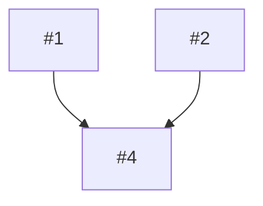

# to-tickets — spec → vertical slices + approval board

> Prior art: Matt Pocock's `to-tickets` skill (MIT), upstream-renamed from `to-issues`. This
> is an adaptation, not a copy. Two differences: the slices are internal work-units rather
> than issues published to a tracker — one `<TICKET-ID>` stays one ticket, and these files
> are only how the work beneath it is parallelised; and the interactive granularity
> interview is replaced by a board you approve or edit.

## When this runs

Only in the `/start-ticket` **decompose path** — the planner set `slice-count > 1` — after
`/to-spec` has written `slice-spec.md`.
[docs/shared/09](../../../docs/shared/09-decompose-path.md) is the whole path.

## Inputs

- `<workspace>/.claude/handoffs/<TICKET-ID>/slice-spec.md` — behaviours and testing seams.
  Primary.
- `<workspace>/.claude/handoffs/<TICKET-ID>/planner.md` — layer allocation, repos and files
  per behaviour, and `## Open questions for grilling`.
- What the **grilling gate** settled: every question is answered, or deferred with an owner
  and a price. The price drives the lanes below.

## What a slice is

A **thin, complete, vertical** path. It goes through every layer of the repo's chain that
the behaviour needs — in the order `## The layer chain` in that repo's `CLAUDE.md` states —
and it is verifiable on its own, by its seam from the spec.

**A single layer is not a slice.** "The schema part" proves nothing, because a schema with
no consumer has no observable result to demonstrate.

## Slicing rules

1. **Independence.** Two slices may share a wave only if there is **no** schema, contract or
   payload member that one changes and the other reads. If there is one, it is a dependency
   edge: one slice blocks the other.
2. **Granularity, default.** One behaviour, across every layer it needs, is one slice.
3. **Granularity, the same change across N independent units.** Prefer **one slice per
   unit**. Each is verifiable on its own seam, and unit-scoped commits keep the blast radius
   readable. Any schema change they all share becomes a **wave-1 slice** that every
   per-unit slice is blocked by.
4. **Order inside a slice still follows the chain.** Parallelism is across slices, never
   inside one.
5. **Dependencies form a DAG.** No cycles. Two slices that would form one are really one
   slice — merge them.
6. **Lanes.** Cross every slice against the deferrals the grilling gate recorded. Each is
   owned and **priced**: how expensive it is to reverse if we guess wrong now. The price
   sets the lane, because an open question can decide whether a slice *exists* or where its
   boundary falls, and that is a slicing-time dependency rather than a hole inside a slice.
   - **READY** — no deferral touches it, or only ones priced cheap, where a sensible default
     was taken and slicing is unaffected. Dispatches normally; every criterion is scored.
   - **DEFERRED REGION** — the slice exists, but a deferral priced expensive lands inside
     it, so that region is placeholdered and nothing depends on it. Write the work-unit,
     declare the **deferred region** and the question it waits on, and mark every criterion
     that touches it **deferred**. The specialist leaves a **fail-loud stub** there — the
     layer's equivalent of `throw NotImplemented("<TICKET-ID> — <question>")` — and never a
     silently guessed default. The rest of the slice still proves on its seam.
   - **PARKED** — the deferral decides whether the slice exists at all, or where its
     boundary falls. **Write no work-unit file**; render a parked card on the board instead.
     `@planner` promotes it in RE-PLAN when the answer arrives, via `/resume-ticket`.

**The lane words are read downstream, so keep them.** `@aligner` treats a declared deferred
region as intentional absence rather than drift, and `@integration-tester` skips a criterion
the board marked deferred. Both look for exactly these markings, in the work-unit and on the
board. Rename them here and each agent silently reverts to flagging a stub as a defect.

## Steps

1. Read `slice-spec.md` and `planner.md`, and take the deferrals from the grilling gate.
2. Draft the slices from the behaviours, applying rules 1–5.
3. For each slice work out: the layers it needs and their chain order, the repos it touches,
   its `blocked by` edges, its acceptance criteria from the spec, its verify seam, and its
   **lane** by rule 6. For a DEFERRED REGION slice, name the region and the question.
4. Write one work-unit per slice to
   `<workspace>/.claude/handoffs/<TICKET-ID>/slices/slice-<N>.md` — for READY and DEFERRED
   REGION slices only. **A PARKED slice gets no file.**
5. Render `<workspace>/.claude/handoffs/<TICKET-ID>/slice-board.md`, including a **Parked**
   section if any slice is parked. Omit that section when none is.
6. **STOP and present the board.** On approval the orchestrator dispatches the READY and
   DEFERRED REGION slices into their worktrees. On an edit, re-slice and re-render. Dispatch
   nothing yourself.

## Slice work-unit — write to `handoffs/<TICKET-ID>/slices/slice-<N>.md`

````
# Slice <N> — <short title>          [<TICKET-ID>]

## Lane
READY | DEFERRED REGION (<region> — pending <the open question>, owner <who>)

## What to build (end to end)
<the behaviour as an observable result — not file paths>

## Layers (chain order)
- [ ] <layer 1> → @slice-<layer-1>-specialist
- [ ] <layer 2> → @slice-<layer-2>-specialist

## Repos touched
- <repo> (<the unit this slice is scoped to, where the change is per-unit>)

## Blocked by
- slice-<M> — shares <schema / contract>        (or "none")

## Acceptance criteria
- [ ] <criterion>
- [ ] <criterion touching the deferred region> — **DEFERRED**, not scored until answered

## Deferred region (DEFERRED REGION lane only — omit for READY)
- <region> — leave a fail-loud stub pending <question>. Never a guessed default.

## Verify (testing seam)
- <the seam from slice-spec.md that proves this slice's non-deferred criteria>

## Handoffs for this slice
- The layer specialists read and write under
  <workspace>/.claude/handoffs/<TICKET-ID>/slices/slice-<N>/
````

## Board — write to `handoffs/<TICKET-ID>/slice-board.md`

````
# <TICKET-ID> — slice board           (approve to dispatch · edit to re-slice)

## Waves (a column runs in parallel)
| Wave 1 (parallel)                  | Wave 2 (after wave 1)          |
|------------------------------------|--------------------------------|
| #1 <title>  <layer1>→<layer2>      | #4 <title>  blocked by #1, #2  |
| #2 <title>  <layer1>               |                                |

## Dependency graph


## Cards
- **#1 <title>** — READY · layers: <chain> · repos: <list> · verify: <seam> · blocked by: none
- **#2 <title>** — DEFERRED REGION · ... · deferred region: <region>, pending <question>

## Parked (no work-unit file until the answer lands)
- **#N <title>** — pending <the open question>, owner <who> — promoted on RE-PLAN
````

## Hard rules

- **Never write to the tracker.** Slices are internal files; one `<TICKET-ID>` is still one
  ticket.
- **Never write to memory.** This is pre-merge and ephemeral.
- **STOP at the board.** Dispatching slices is the orchestrator's job, after you approve.
  End with the `next-steps` block: the board's path and the slice count; that approval is a
  yes typed here, or an edit that re-slices; and that a human who ran this directly has no
  orchestrator waiting — `/start-ticket`, with this ticket's id, is what dispatches the board.
- **Every slice is vertical and independently verifiable.** Reject any slice that is one
  layer.
- **Park a slice, do not create it,** when a deferral decides its existence or its boundary.
  An empty work-unit file is noise a specialist still has to open and rule out.
- **A deferred region ships a fail-loud stub**, and every criterion touching it is marked
  DEFERRED. A silently guessed default is the one outcome that reaches review looking
  finished.
- **Dependencies are a DAG.** Merge any two slices that would form a cycle.
- **If there is really only one slice, say so.** The ticket should not have entered the
  decompose path — tell the orchestrator to fall back to the sequential pipeline. A human who
  ran this directly has no orchestrator to tell, so the `next-steps` block says it to them:
  there is no board to approve, `/start-ticket` with this ticket's id runs it sequentially,
  and nothing was written to the tracker, so nothing needs undoing.
